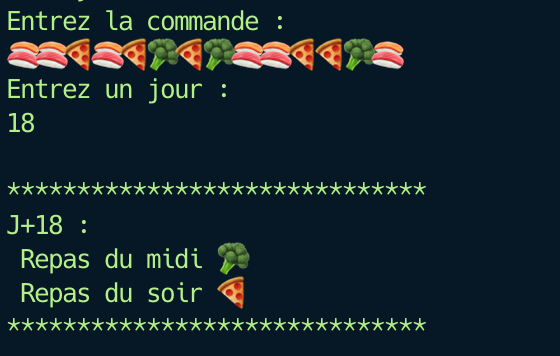
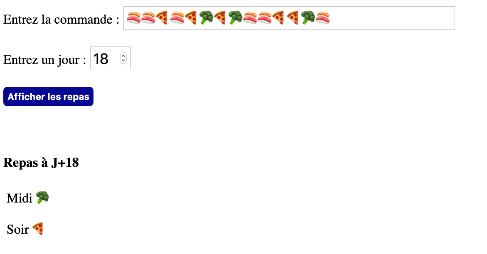

# Triangle du miam

## Introduction

Des scientifiques du MIT viennent de trouver une loi très étrange qui permet de prédire les repas de ses étudiant•e•s plusieurs jours à l'avance et ainsi améliorer la gestion de ses stocks.

À chaque retour de vacances les étudiant•e•s font la liste des repas de la semaine en ayant le choix entre 🍣 (sushi) 🍕 (pizza) ou 🥦 (repas diététique)

Exemple de liste de la semaine (deux repas par jour pendant sept jours) :

🍣🍣🍕🍣🍕🥦🍕🥦🍣🍣🍕🍕🥦🍣 

En regardant les commandes suivantes, des scientifiques se sont rendu compte qu'ils peuvent prédire les quatre-vingts onze repas à venir et cela de manière précise grâce au **théorème du Triangle du miam** 👀...

## Spécifications

- [ ] Chaque combinaison de deux repas permet de faire une prédiction comme ceci :
              
```txt
Combinaison  🍣 🍣   🍣 🍕   🍣 🥦   🍕 🥦
Prédiction    🍣      🥦      🍕     🍣
```

Si deux repas sont similaires, la prédiction sera ce même repas. Sinon la prédiction sera le repas restant.

- [ ] Les prédictions se font par lignes successives de taille `combinaisons précédentes - 1`, ce qui donne naissance au fameux **Triangle du miam**.

En reprenant l'exemple précédent :

```txt
🍣 🍣 🍕 🍣 🍕 🥦 🍕 🥦 🍣 🍣 🍕 🍕 🥦 🍣
 🍣 🥦 🥦 🥦 🍣 🍣 🍣 🍕 🍣 🥦 🍕 🍣 🍕
  🍕 🥦 🥦 🍕 🍣 🍣 🥦 🥦 🍕 🍣 🥦 🥦
   🍣 🥦 🍣 🥦 🍣 🍕 🥦 🍣 🥦 🍕 🥦
    🍕 🍕 🍕 🍕 🥦 🍣 🍕 🍕 🍣 🍣
     🍕 🍕 🍕 🍣 🍕 🥦 🍕 🥦 🍣
      🍕 🍕 🥦 🥦 🍣 🍣 🍣 🍕
       🍕 🍣 🥦 🍕 🍣 🍣 🥦
        🥦 🍕 🍣 🥦 🍣 🍕
         🍣 🥦 🍕 🍕 🥦
          🍕 🍣 🍕 🍣
           🥦 🥦 🥦
            🥦 🥦
             🥦
```

- [ ] Je suis donc en mesure de connaître les repas d'un étudiant à J+18 par exemple, en calculant les jours comme ceci (midi et soir):

```txt
🍣 1 | 🍣 1 | 🍕 2 | 🍣 2 | 🍕 3 | 🥦 3 | 🍕 4 | 🥦 4 | 🍣 5 | 🍣 5 | 🍕 6 | 🍕 6 | 🥦 7 | 🍣 7
 🍣 8 | 🥦 8 | 🥦 9 | 🥦 9 | 🍣 10| 🍣 10| 🍣 11| 🍕 11| 🍣 12| 🥦 12| 🍕 13| 🍣 13| 🍕 14
  🍕 14| 🥦 15| 🥦 15| 🍕 16| 🍣 16| 🍣 17| 🥦 17| 🥦 18| 🍕 18| 🍣 ..| 🥦 ..| 🥦 ..
```

À J+18, cet étudiant mangera 🥦 le midi et 🍕 le soir !

### But du jeu

À partir de ces informations, vous devez réaliser un petit programme qui vous retourne les repas de n'importe quel jour en fonction de la liste des repas de la semaine de départ.

Exemples de rendu :





